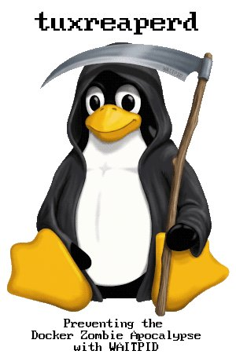

# Tux-Dock
### A lightweight C++ Docker TUI

Tux-Dock is a modern **C++17** Docker terminal frontend built with **FTXUI**.
It gives you a guided, keyboard-first TUI for common Docker operations without memorizing long CLI flags.

---

## Features

- Interactive Docker workflows through a single-screen TUI with modal steps.
- Picker-based selection (arrow keys + Enter) for containers/images instead of numeric menus.
- Busy-operation modals with a spinner and input blocking while Docker work completes.
- Rich container display with state and forwarded ports.
- Interactive shell handoff with clean terminal clear before/after shell transitions.
- Image operations: pull/list/delete with full docker hub image support.
- Docker Engine API access through `/var/run/docker.sock` for structured list and lifecycle operations.
- Direct `fork`/`exec` process execution for CLI-backed streaming and interactive commands.
- Persistent container listings that retain exited containers.
- Robust stop handling with state polling, timeout retry, and idempotent stop responses.
- `tuxreaperd` micro init system: a tiny statically-linked C daemon mounted into created containers as PID 1, acting as a subreaper so orphaned processes never linger as zombies, broadcasting lifecycle signals (SIGTERM, SIGQUIT, SIGINT, SIGHUP, SIGUSR1, SIGUSR2) to the whole process tree via `kill(-1, sig)`, and propagating exit status. Includes architecture-specific `O_DIRECTORY` handling for `x86_64` and `aarch64`, Apache-aware `SIGTERM`→`SIGWINCH`, nginx-aware `SIGTERM`→`SIGQUIT`, and PHP-FPM-aware `SIGTERM`→`SIGQUIT` remapping (with prefix matching for versioned binaries) for graceful shutdown, plus a 60-second container stop timeout so descendants have time to finish. Note: PHP-FPM graceful shutdown also requires `process_control_timeout` to be set in the PHP-FPM pool config (e.g., `process_control_timeout = 60s`). [Processes don't fear tuxreaperd!](tuxreaperdpromo.jpg)
- About screen in-app with project/version/repository info.

---

## Why tuxreaperd?



Most container inits are generic: they spawn one child, forward signals, and reap zombies. That is enough for simple apps, but it breaks down for classic web engines that violate standard UNIX signal conventions:

- **Apache HTTPD** uses `SIGWINCH` for graceful shutdown.
- **Nginx** uses `SIGQUIT` for graceful shutdown.
- **PHP-FPM** uses `SIGQUIT` for graceful shutdown.

`tuxreaperd` encodes those quirks directly. It scans `/proc/<pid>/exe` during signal broadcast and translates `SIGTERM` into the correct graceful-shutdown signal for each daemon, then waits up to 60 seconds for worker descendants to drain.

| Feature / Scenario | `tini` | `dumb-init` | `mini-init-asm` | `tuxreaperd` (~4.7 KB) |
| --- | --- | --- | --- | --- |
| Automatic per-binary signal translation | No | Manual `--rewrite` only | No | Yes (Apache / nginx / PHP-FPM) |
| Zero-config web graceful stops | No | No | No | Yes |
| Post-exit descendant draining | No | No | No | Yes, 60-second bounded drain |
| Multi-pass `/proc` signal sweeps | No | No | No | Two-pass sweep |
| Freestanding / no libc | No | No (unless musl) | Yes | Yes |
| Restart-on-crash | No | No | Yes (`EP_RESTART_ENABLED`) | No |
| Configurable grace → `SIGKILL` timeout | No | No | Yes (`EP_GRACE_SECONDS`) | No (fixed 60s drain) |

Static binary size comparison (KB):

```text
tuxreaperd       |## 4.7
dumb-init (musl) |######## 20
tini             |######### 23
mini-init-asm    |################ 41

dumb-init (glibc static) is ~700+ KB and omitted from the chart for scale.
```

`mini-init-asm` and `dumb-init` are excellent generic inits with useful extras like restart-on-crash or configurable kill timeouts, but they treat workloads as black boxes. `tuxreaperd` trades that generic flexibility for deep, zero-configuration automation of the three web-engine families that actually need signal translation.

---

## Web workload guide

`tuxreaperd` is built for containerized web engines that violate standard UNIX signal conventions. This guide covers Apache HTTPD, nginx, and PHP-FPM.

### Signal conventions

| Engine | Graceful shutdown signal | Fast shutdown signal |
| --- | --- | --- |
| Apache HTTPD | `SIGWINCH` | `SIGTERM` |
| Nginx | `SIGQUIT` | `SIGTERM` / `SIGINT` |
| PHP-FPM | `SIGQUIT` | `SIGTERM` |

When `docker stop` sends `SIGTERM` to PID 1, `tuxreaperd` inspects `/proc/<pid>/exe` and automatically translates the signal:

- Apache processes receive `SIGWINCH`.
- Nginx processes receive `SIGQUIT`.
- PHP-FPM processes (matched by the `/usr/sbin/php-fpm` prefix) receive `SIGQUIT`.

### Required PHP-FPM configuration

PHP-FPM has a known quirk: on `SIGQUIT` its master process exits immediately unless `process_control_timeout` is configured. Without it, the FastCGI socket closes and nginx drops in-flight requests.

Add this to your PHP-FPM pool config (e.g., `/etc/php/8.4/fpm/pool.d/www.conf`):

```ini
[global]
process_control_timeout = 60s
```

Then restart PHP-FPM.

### Starting services inside the container

Create the container with tux-dock, which already injects `tuxreaperd` as PID 1 and sets `--stop-timeout=60`. Then start your web services as descendants:

```bash
# Start PHP-FPM in the background
docker exec my-container /usr/sbin/php-fpm8.4 --nodaemonize &

# Start nginx in the foreground (or background)
docker exec my-container /usr/sbin/nginx -g 'daemon off;'
```

Make sure the binary paths match the ones `tuxreaperd` recognizes:
- `/usr/sbin/apache2`, `/usr/sbin/httpd`, `/usr/local/apache2/bin/httpd`
- `/usr/sbin/nginx`, `/usr/local/nginx/sbin/nginx`
- `/usr/sbin/php-fpm*`, `/usr/local/sbin/php-fpm*`

### Verification: long-running PHP request

Create `/var/www/html/sleep.php`:

```php
<?php
ob_end_clean();
header('Content-Type: text/plain');
header('Cache-Control: no-cache');

echo "Test started at: " . date('H:i:s') . "\n";
echo "Sleeping for 30 seconds...\n";
flush();

sleep(30);

echo "Test finished at: " . date('H:i:s') . "\n";
?>
```

Start the request, then stop the container:

```bash
curl -i http://localhost:8087/sleep.php
# In another terminal:
docker stop my-container
```

Expected result: the full response body is printed, including the “Test finished at: …” line, with no `curl: (18) transfer closed with outstanding read data remaining` error.

### Troubleshooting

- **Connection drops early** → Verify `process_control_timeout` is set in PHP-FPM and restart it.
- **Container stops instantly** → The container must be recreated to pick up `--stop-timeout=60`; existing containers keep their original stop timeout.
- **PHP-FPM not detected** → Confirm the binary path starts with `/usr/sbin/php-fpm` or `/usr/local/sbin/php-fpm`.

---

## Build Requirements

- **C++17 or newer** compiler (e.g. `g++`, `clang++`)
- **CMake 3.16+**
- **Docker Engine** installed and running

---

## Build & Run

```bash
# Clone the repo
git clone https://mentalnet.xyz/forgejo-v2/markmental/tuxdock.git
cd tuxdock

# Configure, build, and test (FTXUI and nlohmann/json are fetched automatically)
./compile.sh

# Run it (requires Docker permissions)
sudo ./build/tux-dock

# Build without running tests
./compile.sh --no-test

# Run tests and serve an HTML 3.2 report on port 8095
./compile.sh --web-test-view

# Override the report server port
./compile.sh --web-test-view 9000

# Force the libc-based tuxreaperd implementation
./compile.sh --force-libc-reaper

# Build with verbose tuxreaperd debug output during tests
./compile.sh --debug-reaper
```

`compile.sh` builds the `tuxreaperd` micro init before the main project. On supported hosts (`x86_64`/`amd64`/`aarch64`/`arm64`) it first tries the freestanding syscall implementation in `tuxreaperdasm.c`; on other architectures, or if the freestanding build fails, it falls back to the standard POSIX implementation in `tuxreaperdgnu.c`. Pass `--force-libc-reaper` to skip the freestanding build and use the libc implementation directly. Pass `--debug-reaper` to build tuxreaperd with `TUXREAPERD_DEBUG` and run tests with verbose output, showing the reaper's internal `/proc` scans, signal broadcasts, and descendant waits.

The web report is generated under `/tmp` and includes exact CTest output, test summaries, Docker integration output, a text rendition of the TUI flow, and the tuxreaperd zombie-reaping results. It requires `nc`, `netcat`, or Nmap's `ncat`; press `Ctrl-C` to stop the server. The default port is `8095`; pass a port after `--web-test-view` to override it. `--web-test-view --no-test` is invalid. Normal test runs include a Docker integration test using `debian:forky`, so Docker must be available. On systems with 1 GB or less of available memory, the script automatically uses a smaller build configuration and a single build job.

---

## Menu Overview

Current TUI actions:

1. Pull Docker Image
2. Create Container
3. List All Containers
4. List All Images
5. Start Detached Container Session
6. Delete Docker Image
7. Stop Container
8. Remove Container
9. Attach Shell to Running Container
10. Run Detached Command in Container
11. Run Command in Container (with output)
12. About Tux-Dock
13. Exit

---

## Design Overview

Tux-Dock is organized around the TUI, Docker manager, Engine API client, and direct process runner:

### Responsibilities

- `DockerEngineClient`
  - Talks directly to Docker over the Unix socket.
  - Parses HTTP responses, including chunked and bodyless responses.

- `ProcessRunner`
  - Executes direct argument vectors using `fork` and `exec`.
  - Supports captured output and inherited terminal I/O.

- `DockerManager`
  - Maps Engine API JSON into application data.
  - Performs lifecycle operations and robust stop-state confirmation.
  - Preserves cached state when refreshes fail.

- `TuxDockApp`
  - Renders the FTXUI interface.
  - Manages modal flows (input/select/confirm/message).
  - Handles modal flows, busy operations, blocked input, and interactive shell transitions.
  - Coordinates end-to-end user flows by calling `DockerManager` methods.

This split keeps Docker behavior isolated while making UI behavior easier to extend.

---

## Testing

```bash
cmake -S . -B build -DBUILD_TESTING=ON
cmake --build build
ctest --test-dir build --output-on-failure
```

`compile.sh` runs these tests by default. Pass `--no-test` to skip them. The suite includes `tuxreaperd-zombie-tests`, which boots a container with `tuxreaperd` as PID 1 and verifies orphaned processes are reaped (no zombies), exit status propagates, and SIGTERM is forwarded on `docker stop`. Docker must be available.

---

## About / Version

- Version: `0.4.2-beta`
- Created by: `markmental`
- GitHub: https://github.com/MARKMENTAL/tuxdock
- Forgejo: https://mentalnet.xyz/forgejo-v2/markmental/tuxdock

---

## License

MIT License — free to use, modify, and share.
